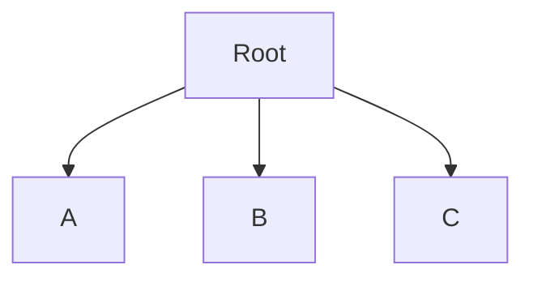
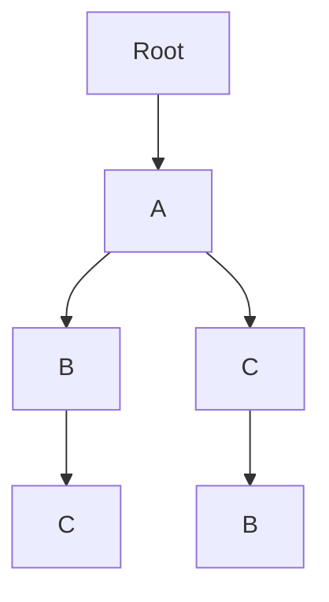
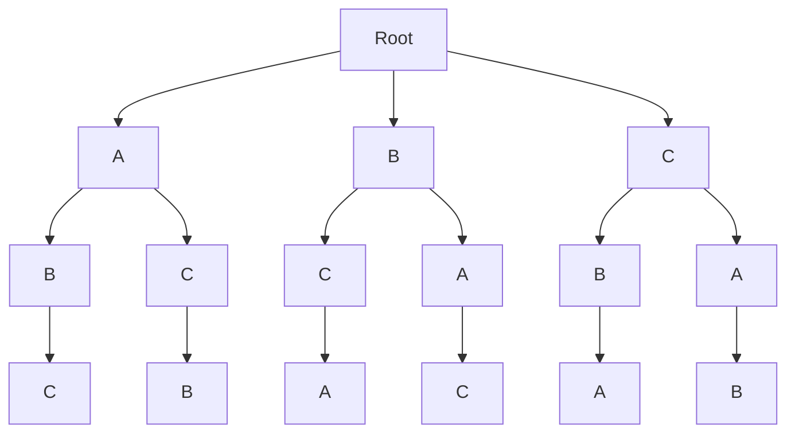

Recursion can be extremely intimiating. It took me years of practice to get good at it. But now I find that countless problems can be easily solved using frequent recrusive patterns.

Many problems can be expressed as trees. And generally, when we have a tree, we traverse it in one of two ways, using either DFS or BFS. The nice thing of about these algorithms is that they have the same shape every single time. This is incredibly because it means if you can solve one problem using DFS, you can solve many problems with DFS.

There are three common tree-inspired interview problems that all have DFS search solution: finding all the combinations in a set, all the subsets in a set (also known as the powerset), and finding the permutations in a set. The recursive solutions to these three problems are all strikingly similar, such that provided you can remember solution to 1, you can construct the solution to the other 2.

## Permutations:

### What Is a Permutation

Let's first talk about what a permutation is. Given a set of elements, a permutation of that set is a reordering of its elements. Here are some examples using strings (which are ordered sets of characters):

Given "ab", we get 2 permutations: `['ab', 'ba']`

Given "abc", we get 6 permutations: `[ 'abc', 'acb', 'bac', 'bca', 'cab', 'cba' ]`

Essentially, if we ask, "what are all the permutations of a string", we are asking for all the ways we can rearrange that string's letters to form a new string.

There are a couple things to note:

1. Each permutation has the same number of letters as the original string.
2. The original input string still counts as a permutation.

### Expressing the Permutation Problem as a Tree

There are handful of ways to solve this problem; in my opinion the recursive one is the most elegant. The first step is to recognize that we can construct represent constructing potential permutations as a tree

Imagine you are given the string `abc`, and you are asked to pick a letter. You have 3 choices, `a`, `b`, and `c`. These nodes form the first level of our tree.



Root is the absence of having picked any characters.

Once you've picked `A`, there are two remaining choices `B`, and `C`. If we then pick `B`, we can also pick the last remaining option `C`. These choices yield the path `A -> B -> C`, though we could have easily chosen `A -> C -> B`. These two choices can be illustrated with a tree:



This is essentially a choose your own adventure game with 6 possible paths:



### Solving the Permutation Problem with Depth First Traversal

Once we understand that all the permutations can be constructed by walking a tree, this problem becomes a known quantity, one which if we are intimately familiar with Depth First Traversal, transforms into a straight-forward exercise.

Depth First Traversal is an algorithm that allows us to walk a tree, visiting every node along the way. It naturally takes every single possible path of the tree, touching each leaf node (and each time finding one permutation) a single time.

First things first, how do we turn a string into a tree? We need to model the behavior above, where we pick one letter at time.

```js
const permutations = str => {
  for (let i = 0; i < str.length; i++) {
    permutations(removeLetter(str, i));
  }
};

const removeLetter = (str, index) => str.slice(0, i) + str.slice(i + 1);
```

Calling `permutations("ABC")`, we get the following call tree. T

his time, each node represents the string that would form if we concatenated each selected letter together, and the transition arrows represent the letter are currently choosing

```mermaid
graph TD;
    Root[Permutation("ABC")] --> | A | A1[A];
    Root[Permutation("ABC")] --> | B | B1[B];
    Root[Permutation("ABC")] --> | C | C1[C];
    A1[A]-->AB[B];
    A1[A]-->AC[C];
    B1[B]-->BC[C];
    B1[B]-->BA[A];
    C1[C]-->CB[B];
    C1[C]-->CA[A];
    AB[B] --> ABC[C]
    AC[C] --> ACB[B]
    BC[C] --> BCA[A]
    BA[A] --> BAC[C]
    CB[B] --> CBA[A]
    CA[A] --> CAB[B]
```

- `permutations("ABC")` // root call
  --`permutations("BC")` // choose `A`
  --`permutations("C")` // choose `B`
  ---`permutations("")` // choose `C`
  --`permutations("B")` // choose `C`
  ---`permutations("")` // choose `B`
  --`permutations("AC")` // choose `B`

Our permutation algorithm will be a slight modification of the typical Depth First Search algorithm.

In my opinion, this version is probably easiest for a beginner of recursion to read. Notice how we close over the `uniqueStrings` variable and mutate it inside our `iter` function.

```js
const permutations = str => {
  const uniqueStrings = [];
  const iter = (str, accum) => {
    // There are no remaining letters to select,
    // so head back up the tree
    if (str.length === 0) {
      uniqueStrings.push(accum);
      return;
    }
    for (let i = 0; i < str.length; i++) {
      permutations(removeLetter(str, i), accum + str[i]);
    }
  };
  iter(str, "");
  return uniqueStrings;
};

const removeLetter = (str, index) => str.slice(0, i) + str.slice(i + 1);
```

Another solution would allow us to get rid of the messy `iter` function and represent `permutation` with a [pure implementation](https://en.wikipedia.org/wiki/Pure_function).

```js
const permutations = (str, accum = "") => {
  if (str.length === 0) {
    return accum;
  }
  let uniqueStrings = [];
  for (let i = 0; i < str.length; i++) {
    // We are combining any newly generated permutations
    // with the ones that we have already found.
    // We are effectively passing state up the stack. This is a very common
    // pattern in tree recursion problems, though it's certainly jarring at
    // first.
    uniqueStrings = uniqueStrings.concat(
      permutations(removeLetter(str, i), accum + str[i])
    );
  }
  return uniqueStrings;
};

const removeLetter = (str, index) => str.slice(0, i) + str.slice(i + 1);
```
