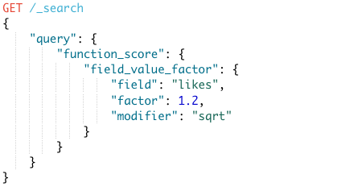
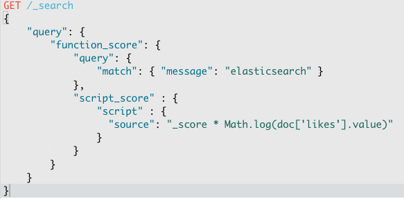
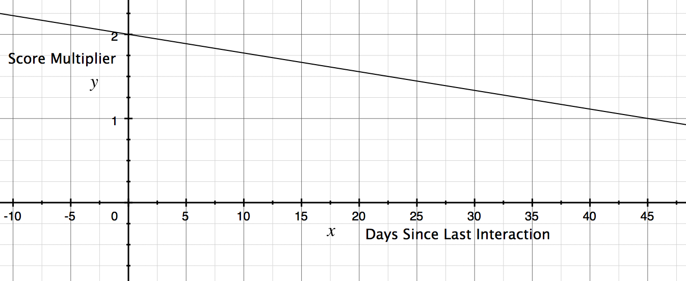

At Fraight, we have an [Elasticsearch](https://www.elastic.co/) backed search interface that allows users to type a freetext query and get a list of our partners sorted by relevancy. At it's core, this is a simple problem: if the user types in `Joe`, return all partners whose name contains the word `Joe`. And indeed, returning all the `Joe`s in the system is straightforward; the problem is that we work with hundreds of `Joe`s. We needed a way to sort to the top the particular `Joe` that the user cares about.

<!-- more -->

## A Poor Solution

When I worked at [Epic](https://www.epic.com/), we had a search interface that allowed users to look up patients by name, and it suffered the same problem described above. Epic solved this problem by providing additional fields like birthdate or address and used this additional identifying information to pare down the search results. This solution slows down the user's workflow and can be improved.

## Our Solution

At Fraight, we created a solution that just works. The user enters a name, and the system returns 5-10 results, and more often than not, the first two results contain the record the user is looking for. Here's how we did it.

We needed to customize the score that Elasticsearch calculates for each matched record. For the uninitiated, Elasticsearch's score is an indicator of the relevancy of a particular document (search result).

Prior to our scoring customizations, given a query for a name, a query for `Joe` would pare down a dataset of ~1,000,000 records to ~100 results, but each of the 100 results might have the same (or a very similar) score if they were all named Joe! Here's how we customized our the Elasticsearch scoring system so that we could sort the 100 results based on what the user needs.

## Custom Elasticsearch Scoring

We settled on two attributes that should influence the score of a particular partner:

1. How often we interact with a partner
2. How recently we've interacted with a partner

It's important to know that we have worked with most of the partners in our system minimally. We needed to remove this noise from the search results. Phrased differently, if we regularly work with a particular `John Doe`, we want that partner to appear above all the other `John Doe`s in the search results.

Similarly, if we have _recently_ interacted with a particular partner, there's a good chance we will interact with them again soon. These partners should rank higher.

It's important, however, to consider the time since our last interaction. If we interacted with someone yesterday, it's important to rank them higher than an a partner we interacted with 10 days ago.

## Getting the Data

Both of these scoring strategies required us to populate Elasticsearch with information detailing the recency and volume of our interactions with each partner. We were lucky to that we already tracked these data points using a change [data capture system](https://en.wikipedia.org/wiki/Change_data_capture). All we needed to do was ensure that any changes to the primary datastore would sync with Elasticsearch.

## Elasticsearch Custom Scoring

Elasticsearch provides [function score queries](https://www.elastic.co/guide/en/elasticsearch/reference/current/query-dsl-function-score-query.html#function-field-value-factor), a declarative syntax that allows the user to modify Elasticsearch's calculated store.

The above function score query tells Elasticsearch to multiply the calculated score by 1.2 times the square root of the `likes` field. This query effectively gives documents with more likes preference over documents with fewer `likes`.

For more customization, Elasticsearch provides [script scores](https://www.elastic.co/guide/en/elasticsearch/reference/current/query-dsl-function-score-query.html#function-script-score) that allow you to write your own scoring function using a Java-like language called [Painless](https://www.elastic.co/guide/en/elasticsearch/reference/master/modules-scripting-painless.html) (it's actually quite painful to program in).

The above function specifies a query that searches for the word `elasticsearch` inside the `message` field.

It then multiplies the score of every matching result by the `script_score`:

`_score * Math.log(doc['likes'].value)`

This particular script score augments Elasticsearch's calculated score, which is represented by `_score`. It multiplies that score by the log of the number of `likes` on each matching document.

Effectively, script scores allow you to modify the score however you like.

## Custom Scoring Implementation

We elected to use a script score to solve our ranking problem and wanted our ultimate score to be a function of three values:

1. The score returned from Elasticsearch
2. Our total number of interactions with a partner
3. The number of days since our last interaction with a partner

### Initial Attempt

In our first iteration, we only considered `1` and `2`. Our scoring function looked like this (as a heads up, in the rest of this post I'm going to use my script score own syntax let us focus on what's important):

`newScore = _score * sqrt(numInteractions + 1)`

We wanted partners we've worked with most to rise to the top of the search results. The square root tempers the affect of the `numInteractions` on the score, and the `+1` was to ensure that for partners where `numInteractions` is 0 that we didn't make the `newScore` equal to 0.

### Introducing an Upperbound

The above solution resulted in an overwhelming preference towards certain partners. In realty, we do not value more highly a partner with whom we've interacted 1000 times any more than a partner with whom we've interacted 100 times. Taking this feedback into account, our new scoring function looked like this:

`newScore = _score * (numInteractions > 100 ? 2 : 1)`

We effectively created a step function where the original Elasticsearch score is either doubled or left unchanged. This creates an upperbound on the amount that `numInteractions` can influence the resulting score. Originally, we had discussed more complicated techniques like [logistic functions](https://en.wikipedia.org/wiki/Logistic_function), but the above strategy has worked fine.

### Incorporating Time

I mentioned earlier that when we form a new partnership, there's a good chance we will interact with that partner again soon. The above scoring strategy will ignore these newer partners (since we've interacted with them fewer than 100 times), favoring those we've worked with many times, even if we haven't talked to those partners in months.

Ultimately, we wanted our function to double the original score if we've interacted with a partner today. Afterwards, we wanted the score contribution to decay, such that the original score would be unchanged after 45 days of not interacting with a partner.

### Deriving the Formula

We can create a formula that satisfies this constraint by consulting our high school math book and paging to the section on [point slope form](https://en.wikipedia.org/wiki/Linear_equation#Point%E2%80%93slope_form).

Starting from

`y2 - y1 = m(x2 - x1)`

where

- `m` is the slope,
- `y` is the Elasticsearch score multiplier
- `x` the number of days since last interacting with a partner

We want a line that passes through the following two points `(0, 2)` and `(45, 1)` Plugging into the above equation gives us

-> `2 - 1 = m(0 -45)`
-> `m = -1/45`

Let's plug this back into a slight rewrite of the original equation, `y = mx + b`.

Given that when `x` is `0` we know that `y` should be `2`, we get the following equation:

`y = -(1/45)x + 2`

Here is what the equation looks like when graphed:

If we only wanted the above function to contribute to our Elasticsearch score, you might assume it would look like this:

`newScore = _score * (-1/45) * timeSinceLastInteraction + 2`

There's a small problem. See if you can figure it out by looking at that graph?

I can tell you that `timeSinceLastInteraction` will never be negative, but what happens when the `timeSinceLastInteraction` exceeds 45 days? What happens when it grows even more? We want an equation that multiplies the score by `1` at minimum.

`newScore = _score * Max((-1/45) * timeSinceLastInteraction + 2, 1)`

If we take take the maximum of our equation and `1`, then we can be positive that we will never multiply the score by anything less than `1`.

### Putting it All Together

This is the straightforward part. We need to combine the two equations, resulting in a final form that looks like this:

`newScore = _score * (numInteractions > 100 ? 2 : 1) + Max((-1/45) * timeSinceLastInteraction + 2, 1))`

- `(numInteractions > 100 ? 2 : 1)` varies between `1` and `2`

- `Max((-1/45) * timeSinceLastInteraction + 2, 1))` varies between `1` and `2`

This means that we will multiply the Elasticsearch calculated score by a number between `1` and `4`. We achieved our goals.

1. We favor partners we've talk to many times (more than 100 interactions)
2. We favor partners we've talked to recently
3. We most strongly favor partners who we've talked to many times and have talked to recently.

Additionally, we achieve a couple less obvious but super important goals

1. We always factor in the Elasticsearch score. Note that the minimum multiplier is 1. We don't have any data that should allow us to rule certain documents out of the results.
2. The Elasticsearch score is never drowned out. This point is subtle but distinct from the above point. We don't want a frequently used partner with the name `joe stevens` to outrank `joe smith` when the query is for `joe smith`.
3. No one factor dominates the equation to calculate the resulting score. We consider both total interactions and time since last interaction equally (these could be weighted in a more sophisticated solution).

## Other Domains

You can apply these techniques to many other domains.

For example, I suspect that hospital staff are more likely to look up patients who have upcoming appointments, a same-day appointment, or who have recently finished an appointment. You could write a function like the one we used to factor in the recency of interaction with our partners

Or suppose you run an event website like Ticketmaster or Eventbrite. I'm sure there's a correlation between the how soon an event is and how much user's care about it. You could write a scoring function that leverages this knowledge.

Maybe you have an e-commerce site Amazon. It might be valuable to have a set of rules that determine which items are ranked above others. Perhaps affiliate products appear first? Maybe after that we sort by a combination of review rating and relevancy?

_If you have search problems, I do [consulting](/hire-me) work and am currently looking for new clients. Please [contact me](mailto:nick@nickdrane.com) for more details._
