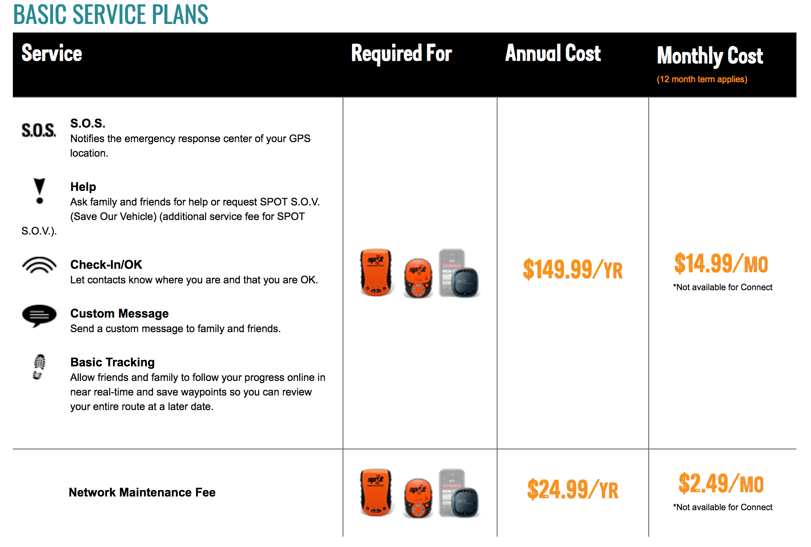

Two months ago I purchased a GPS device and associated service plan from [SPOT](https://www.findmespot.com/en/). Today, upon trying to cancel the service, the customer service representative informed me that I had accidentally enrolled myself into a 1 year, \$250 contract and that I was unable to cancel. He told me that if I blocked the monthly charges against my credit card that they would report the debt to a collections agency. I was initially upset but soon realized it was a great opportunity to talk about ethics in software engineering.

<!-- more -->

## SPOT's Marketing Materials

The representative told me to look at their website where he claimed it would be very clear that I was signing up for a contract service. When I Googled "spot service plan", the first link I clicked on directed me to these marketing materials:

If you look at the image above, it appears as if several deliberate decisions have been made to disguise the total cost of the month-to-month arrangement.

1. The font of the month-to-month price is large, bold, and colorful. It's designed to stand out
2. The 12 month contractual stipulation, on the other hand, is written in unnecessarily small font
3. The contractual stipulation is low contrast and visually underwhelming, particularly when juxtaposed against the big, bright, and bold "monthly cost" header
4. The terms of the contract are visually separated from the price

None of this could be chalked up to accident, except perhaps point 3. Ultimately, this page's content is designed to mislead the consumer, hurting them for the business's gain.[1](#footnote1)

## Software Ethics and Mainstream Media

The software industry is rife with ethics scandals, and they are rarely cut and dry. Some examples

1. [Dozens of iPhone applications selling user location data](https://techcrunch.com/2018/09/07/a-dozen-popular-iphone-apps-caught-quietly-sending-user-locations-to-monetization-firms/)
2. [United States surveillance software (PRISMA)](https://en.wikipedia.org/wiki/PRISM_(surveillance_program)
3. [DOD's Project Maven (drone imaging AI)](https://money.cnn.com/2018/06/01/technology/google-maven-contract/index.html)

Two arguments exist in each of these scenarios. iPhone application engineers might argue that they aren't hurting consumers by selling their location information. Governments argue that they protect their citizens through surveillance software, even if that's at the cost of citizen privacy. An engineer of that very software might believe that the code itself is not unethical, only improper use of it. A utilitarian might argue that software that facilitates accurate drone strikes is ethical if the cost of the deaths of its targets is outweighed by its net good. Ultimately, it's often unclear what constitutes unethical. But it raises a good question: as software engineers, what ethical code should we live by?

## Ethics for the Average Engineer

It's easy to get consumed in the minutia. The media tends to focus on ethics scandals that have immense gravity, either in the scope of the number of people they affect or in the magnitude with which they affect their targets. But the majority of software engineers aren't writing software that necessitates answering the above questions. Most of us are writing simple e-commerce applications or iPhone apps -- boring software.

The case study with SPOT is interesting precisely because of how boring it is. It's true to life, and it serves as a reminder that the average engineer also faces ethical dilemmas. And fortunately for us, these "ethical dilemmas" are sometimes pretty cut and dry, provided we have the awareness to recognize them and the courage to speak up. In the case with SPOT, I think most people would agree that making an effort to mislead the consumer is dishonest and thus unethical.

## The Takeaway

Just because you work on boring software does not mean that it can't negatively impact your users in an unethical way. The first step towards protecting users is increased developer awareness. As a developer, it's essential to ask how your software affects your users. If it might hurt them, step back and consider the the greater picture. If you think your code might manipulate or mislead your users, it's time to speak up.

#### Footnotes

<a name="footnote1">1</a>: I think it's important to be fair here. The marketing material across the site is inconsistent and ranges in the clarity of its term of service. [This page](https://www.findmespot.com/en/index.php?cid=131) makes the 12 month contract abundantly clear. [This one](https://www.findmespot.com/en/index.php?cid=130) falls somewhere in the middle.
