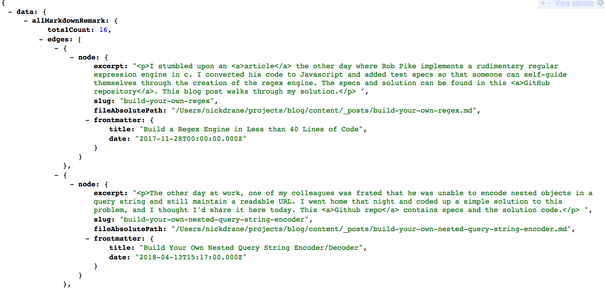

In my article [comparing Gatsby to Hexo](/hexo-vs-gatsbyjs-comparing-nodejs-static-site-generators), I talked about my experience switching writing this blog using [Hexo](https://hexo.io/) and then later using [Gatsby](https://www.gatsbyjs.org/). In the process, the size of my initial page ballooned 5x.

In retrospect, I did not fully understand the abstraction that Gatsby provides. Fortunately, if you follow a simple rule of thumb, you can avoid bloating your network requests and maintain an ultra-performant website.

<!-- more -->

## Process as Much Data with GraphQL as Possible

If you walk away learning nothing else, this is the most important point.

When you build your website, Gatsby will effectively run all of the GraphQL queries needed to load each page and save the resulting JSON. When you visit a given page on your site, requests will be made for these JSON payloads, completely unmodified.

I originally thought that `gatsby build` would combine my react components and GraphQL requests, transforming them into HTML, resulting in a website that sends strictly HTML over the wire. This is not the case (unless the client has JavaScript disabled)! Here a small piece of the JSON payload for the homepage of my website:



So what does this mean for you?

1. Do not request data that you don't need. This rule of thumb is obvious in a typical Single Page Application, but it applies here too. We want to minimize the size of our HTTP responses.

2. If you can do [filtering, sorting, or limiting in GraphQL](https://www.gatsbyjs.org/docs/graphql-reference/), do it there instead of at the application layer.

The second points bears explanation. Here are two functionally equivalent chunks of code to grab the html of the 5 most recent posts.

## Post-Processing GraphQL results with JavaScript

```graphql
{
  allMarkdownRemark {
    edges {
      node {
        html
        frontmatter {
          date
        }
      }
    }
  }
}
```

```js
// Assuming data is the result of the above GraphQL query
const mostRecentPosts = data.allMarkdownRemark.edges
  .map(edge => edge.node)
  // Sort each post by dates in reverse chronological order
  .sort((node1, node2) => {
    const a = new Date(node1.frontmatter.date);
    const b = new Date(node2.frontmatter.date);
    return a > b ? -1 : a < b ? 1 : 0;
  })
  // Grab the 5 most recent ones
  .slice(0, 5);
```

## Everything in GraphQL

```graphql
{
  allMarkdownRemark(
    limit: 5
    sort: { fields: [frontmatter___date], order: DESC }
  ) {
    edges {
      node {
        html
      }
    }
  }
}
```

I was initially uncomfortable with GraphQL and coded everything in the former style, making broad GraphQL queries and later performing additional processing using JavaScript. This strategy has numerous problems.

1. As I mentioned above, instead of grabbing the html of just 5 posts, we are grabbing it for every post. This translates directly into what is sent over the wire when someone loads the page, bloating the site. To compound the problem, the performance hit grows with every single post we add to our site.

2. Not only am I grabbing more posts than I need, every post includes additional information. Notice in the second example that we don't need to query the date because sorting is handled by GraphQL.

3. Lastly, the second example is so much more readable

## Conclusion

Gatsby is a powerful static site generator, though it's not immediately obvious how your code influences the resulting site's performance. You can make great strides, however, if you always offload as much work onto GraphQL as possible.
