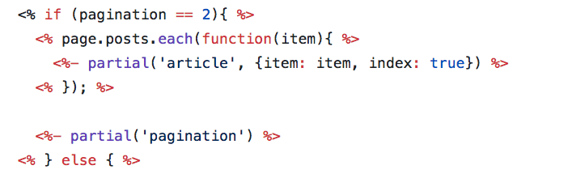
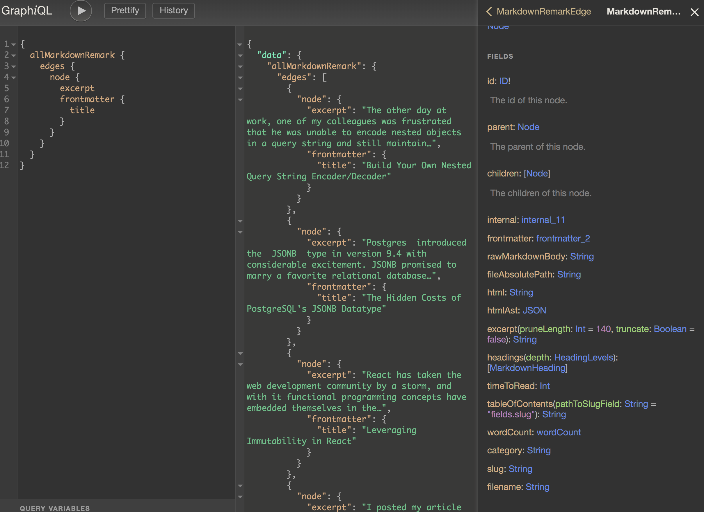

There are two major [static site generators](https://davidwalsh.name/introduction-static-site-generators) in the Javascript ecosystem: the incumbent [Hexo](https://hexo.io) and the up-and-coming [Gatsby](https://www.gatsbyjs.org/). This site was first built with Hexo, but I've recently switched to Gatsby. Let's talk about why.

<!-- more -->

## Different Products

First, let's talk high level. Hexo and Gatsby both generate static websites, but at their hearts, they are very different products. Hexo is a blog generator; Gatsby is a generalized static site generator. Let me elaborate.

### Hexo

Hexo specializes in creating markup (be it [markdown](https://en.wikipedia.org/wiki/Markdown) or [reStructuredText](https://en.wikipedia.org/wiki/ReStructuredText)) driven blogs. This specialization comes with tradeoffs. It's simple to get a blog up and running, but if you want to do anything more complicated, it ranges from challenging to impossible. This limitation might not restrict you, however.

### Gatsby

Gatsby epitomizes customizability and allows for the creation of arbitrarily complex static sites, ranging from simple blogs to fully featured e-commerce websites. It provides [an API](https://www.gatsbyjs.org/docs/node-apis/) for you to build and query a [GraphQL](https://graphql.org/) API composed of data from a variety of sources. You can then dynamically compose your static website based on the results of your queries. Gatsby trades power for complexity, requiring users to learn some new tools to leverage its capabilities.

Let's get into the nitty gritty details.

## Getting Up and Running

Both platforms make it easy to get from `yarn install` to writing blog articles, though Hexo definitely excels in this regard.

### Hexo

With Hexo, I was able to install the application, run a couple [configuration commands](https://hexo.io/docs/setup), pick a [theme from their website](https://hexo.io/themes/index.html), and start writing.

### Gatsby

Gatsby's sheer volume of documentation made the setup process slightly more challenging, though hardly difficult. There are two places you can start: their [getting started page](https://www.gatsbyjs.org/docs/) or [their tutorial](https://www.gatsbyjs.org/tutorial/). The former will link you to their [starter library](https://www.gatsbyjs.org/starters/?v=2) and will help you get a server up and running. The latter will teach you how to customize your website.

## Developer Experience

Hexo does not provide any tooling out-of-the-box, and your experience is largely determined by your theme. Gatsby, in contrast, optimizes for developer productivity.

### Hexo

When I began with Hexo, I picked a theme called [Concise](https://github.com/hmybmny/hexo-theme-concise), and my experience mostly stems from customizing this theme. Hexo originally only supported a dated templating language called [EJS](https://ejs.co/), and most themes including Concise use it. Here is some sample code from Concise.

Apart from the obvious readability problems, the syntax is challenging to edit and thus is at odds with application discoverability. It makes trivial exercises like console logging error-prone. Furthermore, the syntax is incompatible with the modern formatting tool, [Prettier](https://prettier.io/).

Today Hexo supports other templating languages, but it's a shame so many themes are tightly coupled to such an unergonomic tool.

### Gatsby

Gatsby emphasizes the developer experience, using [React](https://reactjs.org/) and [GraphQL](https://graphql.org/) as the foundation for every Gatsby application. These tools and their ecosystems were immediate productivity boosters for me, though they do have a non-trivial learning curve. Fortunately, the Gatsby docs assume no prior knowledge, and realistically, you only need minimal understanding to be productive.

The aforementioned [Gatsby API](https://www.gatsbyjs.org/docs/node-apis/), which is used the define the pages of your site (among other things), also requires study to understand. It's powerful but lacks detailed documentation. Use cases for the various methods and hooks are scattered throughout the docs, though I was able to supplement the documentation with blogs/tutorials such that learning the API was manageable.

Gatsby also automatically configures numerous developer tools to optimize your productivity. For example, [GraphiQL](https://github.com/graphql/graphiql) (more on this later) allows you to explore your data sources, Prettier ensures that your code remains consistently formatted, hot-reloading updates your UI without refreshing, and [ESlint](https://eslint.org/) catches your mistakes.

Behind the scenes, Gatsby configures [webpack](https://webpack.js.org/) for you, abstracting away the most challenging parts of the React ecosystem. It goes to extra mile and things like service workers, inlining critical CSS, and CSS modules are automatic or a plugin away. Here is an exhaustive list of its [features](https://www.gatsbyjs.org/features/).

## Documentation

Documentation can make or break a developer's experience, and Hexo and Gatsby approach documentation very differently.

### Hexo

Hexo does a great job of ensuring you need to read as little text as possible to get a blog up and running. If you want to customize your blog, however, the documentation's previously appreciated brevity shows it's warts. I would often read a page and have no idea what I was looking at, even when it was exactly what I needed.

For example, if you want to customize your theme, you will need to know what variables Hexo injects into your template engine's rendering system. This [site](https://hexo.io/docs/variables.html) provides the details but doesn't provide an overview explaining its purpose.

I should provide one qualifying statement. Hexo augments its documentation with video tutorials. I never noticed them until I chose to write this article, but perhaps they provide the detail I previously yearned for.

### Gatsby

Gatsby's documentation is thoughtful, well-organized, and detailed. It has everything from [tutorials](https://www.gatsbyjs.org/tutorial/) to deep dives [1](https://www.gatsbyjs.org/docs/adding-images-fonts-files/), [2](https://www.gatsbyjs.org/docs/creating-and-modifying-pages/), [3](https://www.gatsbyjs.org/docs/styling/). It even has pages explaining and justifying [architecture and implementation details](https://www.gatsbyjs.org/docs/behind-the-scenes/). And to top all this off, it has a [style guide](https://www.gatsbyjs.org/docs/gatsby-style-guide/) to ensure readability.

With all this said, there are still [placeholder pages](https://www.gatsbyjs.org/docs/dropping-images-into-static-folders/), though I never found myself unable to answer a question about their system.

## API Discoverability

A static site generator needs to make it easy to edit your website. One of the first requirements to editing your site is understanding the data structures the static site generator makes available to you.

### Hexo

Hexo documents its data structures in the [link mentioned above](https://hexo.io/docs/variables.html). The page references many key topics but never elaborates. I remember agonizing over providing support for both pagination and article excerpts.

The page seems to hint that the next and previous blog posts are available from their API, though the fields were always `undefined`. I never figured out why.

It also suggests excerpts are available. It wasn't until I discovered this [GitHub issue](https://github.com/hexojs/hexo/issues/1143) that I learned it's required to add the comment `<!-- more -->` to each post to ensure that this excerpt is populated. This feature is otherwise undocumented.

Moreover, EJS prevents rapid code changes and thus data structure exploration, exacerbating these documentation problems.

### Gatsby

Gatsby solves the problem of discoverability with [GraphiQL](https://github.com/graphql/graphiql). It automatically spins up a GraphiQL server which allows you to interactively browse your data. Here is a simple example that queries article excerpts and titles:

You can see the query on the left, the results in the middle, and interactive schema documentation on the right. To top it all off, the environment provides autocomplete and errors messages.

The contrast with Hexo's variable page is stark.

## Community

A large and active community makes on-boarding easier. It means more people have run into the same problems, which often translates into more tutorials and more stack overflow questions answered. Community quality can heavily influence a developer's experience.

### Hexo

Hexo is the most popular static site generator in the JS ecosystem, though I did not feel like the this made solving problems easier. I had numerous question I had to answer by consulting the source code.

I think my experiences stems from the fact that Hexo's user base is largely Chinese. Unless your bilingual, this makes potentially helpful documentation and conversations inaccessible.

### Gatsby

I've been blown away by the quality of Gatsby's community so far.

The maintainers have written tutorials about how to migrate from other blogging platforms, and dedicated community members write about solving their own problems.

I've also been impressed as a contributor to Gatsby. I ran into an issue where excerpts only rendered in plain text, not HTML. I opened a [PR](https://github.com/gatsbyjs/gatsby/pull/9716) to fix this problem and received prompt and thoughtful replies.

## Plugin Ecosystem

### Hexo

Hexo has a [plugin page](https://hexo.io/plugins/index.html) detailing links to everything from markdown parsers to image and css optimizers. There are 277 plugins available, and I never ran into a situation where I couldn't find a plugin to do what I needed.

### Gatsby

Gatsby has a [plugin search system](https://hexo.io/plugins/index.html) with twice as many plugins - 550 to be exact - available to date, though it's not clear to me how much additional value this offers over Hexo.

On a side note, I appreciated that Gatsby sorts their plugin search results based on number of downloads. This primitive but effective metric makes it easier to evaluate the quality of a given plugin.

## Performance

There are two types of performance relevant to this discussion: the speed of the static site generator itself, and the speed of the website it produces.

If a a static site generator is slow to render your changes, it slows down your development speed. Fortunately, both Hexo and Gatsby refresh changes without perceptible delay.

The speed of the sites these tools produce varies quite drastically.

### Hexo

With Hexo, the speed of your static site will be completely coupled to your theme. Your theme might load tons of unnecessary javascript; it also might not use any.

The most important point here is that Hexo adds absolutely no overhead to your website. It introduces no additional dependencies into your built project. If you want a pure static site without any javascript, you can create that. If you want no page to exceed 40kb, that's entirely doable.

### Gatsby

Gatsby takes a much different approach.

For starters, it introduces a javascript dependency into your web site, clocking in around 65kb. Aside from the fact that this dependency is larger than any single page on my original Hexo website, it also means that your site will never be able to run on browsers without javascript enabled. It does give quite a few benefits in return, however.

Gatsby either automatically or through plugins applies numerous performance tricks to every website. To explain a few:

1. When you reference a style sheet using a `link` tag, the page blocks rendering until the entire roundtrip server request is complete. Gatsby circumvents this problem by inlining critical CSS into your HTML.

2. When you visit a page, once it has finished loading, Gatsby will begin loading every page you can reach from the page you're on. This technique is known as prefetching and makes subsequent page loads fast.

3. Gatsby uses [service workers](https://developers.google.com/web/fundamentals/primers/service-workers/) via [gatsby-plugin-offline](https://www.gatsbyjs.org/packages/gatsby-plugin-offline/) to cache all the pages you download. This allows subsequent requests for those pages to hit the cache instead of the network. It also allow for users to browse your page offline later.

4. [Gatsby Image](https://www.gatsbyjs.org/packages/gatsby-image/) preprocesses and calibrates images for various screen sizes. This ensures that high resolution screens get high resolution images and vice-versa, resulting in significant bandwidth savings for smaller screens.

All of these performance abstractions don't come without a cost. I think my experience was quite telling. When I finished my Hexo website, the main page was about 40kb; when I finished my Gatsby website, the main page was ~200kb, though it's a little difficult to be precise, which brings me to my next point.

Optimization is initially challenging and opaque with Gatsby. When I started, not only did I have no idea my final site would contain Javascript, I had no idea what would influence its performance.

It turns out that everything I returned from my GraphQL queries would be loaded at runtime, regardless of whether the site used it. Similarly, any dependencies used in my application code made it into the final bundle. These were facts I simply didn't understand going in, and they've influenced how I will use Gatsby going forward. This contrasts with Hexo where the performance consequences of my development choices were obvious.

## Conclusion

Hexo are Gatsby are different products. If you're interested in picking a theme, spinning up a blog, and perhaps tweaking it, Hexo might be a simpler choice. If, however, you want flexibility and a productive developer experience, Gatsby overshadows Hexo in nearly every way.
